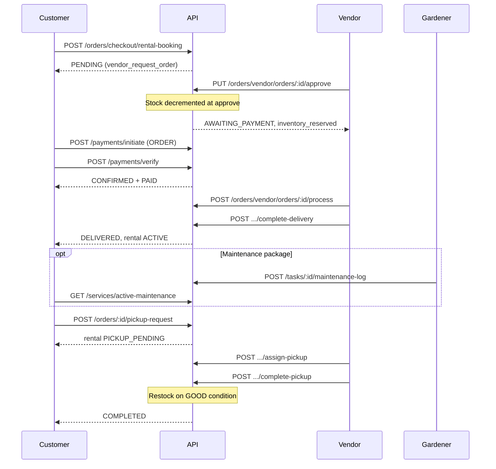

# Plant Rental Platform — API Contract

**Version:** 2026-05 (Rental Workflow)  
**Base URL:** `/api/v1`  
**Format:** JSON unless noted (`multipart/form-data` for file uploads)

---

## Table of contents

1. [Authentication](#authentication)
2. [Response envelope](#response-envelope)
3. [Enums & status model](#enums--status-model)
4. [End-to-end rental workflow](#end-to-end-rental-workflow)
5. [Inventory](#inventory)
6. [Vendor packages](#vendor-packages)
7. [Cart](#cart)
8. [Orders — customer](#orders--customer)
9. [Orders — vendor](#orders--vendor)
10. [Pickup & return](#pickup--return)
11. [Payments](#payments)
12. [Maintenance & tasks](#maintenance--tasks)
13. [Rental extensions](#rental-extensions)
14. [Complaints](#complaints)
15. [Order history & reviews](#order-history--reviews)
16. [Notifications](#notifications)
17. [Error handling](#error-handling)

---

## Authentication

All protected routes require:

```http
Authorization: Bearer <access_token>
```

| Role | Description |
|------|-------------|
| `USER` | Customer |
| `VENDOR` | Nursery owner |
| `GARDENER` | Nursery staff |
| `ADMIN` | Platform admin |

Obtain tokens via `POST /api/v1/auth/login` or `POST /api/v1/auth/register` → `POST /api/v1/auth/verify-otp`.

---

## Response envelope

Many modules return a contract envelope:

```json
{
  "success": true,
  "data": { }
}
```

Errors:

```json
{
  "success": false,
  "error": {
    "code": "BAD_REQUEST",
    "message": "Human-readable message"
  }
}
```

Some legacy order/payment routes return the resource object directly (no envelope). Clients should accept both shapes.

---

## Enums & status model

### OrderStatus

| Value | Meaning |
|-------|---------|
| `PENDING` | Awaiting vendor approval |
| `AWAITING_PAYMENT` | Vendor approved; customer must pay |
| `CONFIRMED` | Paid (or approved without slot flow) |
| `SLOT_PROPOSED` | Vendor proposed delivery slots |
| `SLOT_CONFIRMED` | Customer confirmed a slot (may still be unpaid) |
| `PROCESSING` | Vendor processing after payment |
| `OUT_FOR_DELIVERY` | Out for delivery |
| `DELIVERED` | Delivered |
| `COMPLETED` | Rental cycle complete (pickup done) |
| `CANCELLED` | Cancelled |
| `EXPIRED` | Expired |
| `RETURNED` | Legacy order-level return |

### PaymentStatus

`PENDING` · `PAID` · `PARTIALLY_REFUNDED` · `REFUNDED` · `FAILED`

### RentalStatus (per order line)

| Value | Meaning |
|-------|---------|
| `ACTIVE` | Rental in progress |
| `EXTENDED` | Extended rental |
| `OVERDUE` | Past end date |
| `PICKUP_PENDING` | Customer requested pickup; not yet collected |
| `RETURNED` | Line returned and closed |

### PickupRequestStatus

`REQUESTED` · `SCHEDULED` · `COMPLETED` · `CANCELLED`

### OrderComplaintType

`DAMAGED_PLANTS` · `INCORRECT_DELIVERY` · `UNHEALTHY_PLANTS` · `MISSING_ITEMS` · `MAINTENANCE_ISSUE` · `PICKUP_PROBLEM` · `OTHER`

### Customer order tabs

Returned on enriched order objects as `customer_order_tab`:

| Tab | When |
|-----|------|
| `customer_order_pending` | `PENDING` or pre-payment slot flow |
| `Payment` | Approved / awaiting payment |
| `Delivered` | Paid and in fulfillment (`PROCESSING`, `OUT_FOR_DELIVERY`, `DELIVERED`) |

### Fulfillment line condition (pickup/return)

`GOOD` · `DAMAGED` · `NEEDS_ATTENTION` · `MISSING`

---

## End-to-end rental workflow



### Business rules

| Rule | Behavior |
|------|----------|
| Stock reservation | `stockQuantity` decrements on **vendor approve**, not at checkout |
| Payment gate | `POST /payments/initiate` for orders requires `CONFIRMED`, `SLOT_CONFIRMED`, or `AWAITING_PAYMENT` |
| After approve | Order → `AWAITING_PAYMENT`; customer tab → `Payment` |
| After verify | Order → `CONFIRMED` + `paymentStatus: PAID` |
| Return vs pickup | `POST .../items/:id/return` delegates to pickup request (non-terminal) |
| Pickup complete | Sets line `RETURNED`, optionally restocks, order → `COMPLETED` |
| Cancellation window | Configurable via `ORDER_CUSTOMER_CANCEL_WINDOW_HOURS` (default 8h) |

---

## Inventory

**Auth:** `VENDOR`

### GET `/inventory`

Vendor inventory board.

| Query | Type | Description |
|-------|------|-------------|
| `search` | string | Filter by plant name |
| `page` | number | Page (default 1) |
| `limit` | number | Page size |

**Response (`data`):**

```json
{
  "items": [
    {
      "plant_id": "uuid",
      "name": "Monstera",
      "stock_quantity": 12,
      "primary_image_url": "/uploads/plants/...",
      "is_available_for_rent": true
    }
  ],
  "pagination": { "page": 1, "limit": 20, "total": 45, "totalPages": 3 }
}
```

### GET `/inventory/picker`

Lightweight plant list for package creation UI.

| Query | Type |
|-------|------|
| `search` | string |

**Response:**

```json
{
  "items": [
    { "plant_id": "uuid", "name": "Monstera", "stock_quantity": 12 }
  ]
}
```

### POST `/plants/vendor/plants/inventory`

**Content-Type:** `multipart/form-data`

| Field | Type | Required |
|-------|------|----------|
| `name` | string | yes |
| `stock_quantity` | integer | yes |
| `image` | file | yes |

Creates a minimal catalog plant (name + stock + single image). Use `POST /plants/vendor/plants` for full catalog entries with pricing.

---

## Vendor packages

### Public catalogue

#### GET `/nurseries/:nursery_id/vendor-packages`

List active rental packages for a nursery. No auth.

#### GET `/nurseries/:nursery_id/packages/:package_id/available-plants`

Plants selectable for a package (in-stock by default).

| Query | Type | Description |
|-------|------|-------------|
| `include_out_of_stock` | boolean | Include zero-stock plants |

**Response:**

```json
{
  "package_id": "VPkg-ABC123",
  "plants": [
    {
      "plant_id": "uuid",
      "name": "Snake Plant",
      "stock_quantity": 5,
      "available": true
    }
  ]
}
```

### Vendor CRUD

**Auth:** `VENDOR` · Base: `/vendor/packages`

| Method | Path | Description |
|--------|------|-------------|
| `POST` | `/` | Create package |
| `GET` | `/` | List (`?is_active=true\|false`) |
| `GET` | `/:package_id` | Get one (public id or UUID) |
| `PUT` | `/:package_id` | Update |
| `PUT` | `/:package_id/plants` | Replace assigned plants |
| `DELETE` | `/:package_id` | Soft-deactivate |

#### POST `/vendor/packages` — body

```json
{
  "name": "Corporate corner office",
  "tier": "STANDARD",
  "description": "Up to 12 plants with monthly maintenance",
  "max_plant_count": 12,
  "rental_duration_days": 30,
  "includes_maintenance": true,
  "maintenance_visits_per_month": 2,
  "base_price": 4999.0,
  "deposit_amount": 500,
  "allows_installments": false,
  "add_ons": {
    "premium_pot": { "price": 150, "label": "Premium ceramic pot" }
  },
  "delivery_slots": [
    { "day_of_week": "MON", "time_from": "09:00", "time_to": "12:00", "capacity": 5 }
  ],
  "plants": [
    { "plant_id": "uuid", "quantity": 1 }
  ],
  "is_active": true
}
```

#### PUT `/vendor/packages/:package_id/plants` — body

```json
{
  "plants": [
    { "plant_id": "uuid", "quantity": 1 }
  ]
}
```

Alias: `{ "plant_ids": ["uuid", "uuid"] }` (quantity 1 each).

---

## Cart

**Auth:** `USER` · Base: `/cart`

### POST `/cart/packages`

Add a package line. One of:

| Field | Description |
|-------|-------------|
| `package_id` | Legacy `PlantPackage` |
| `custom_package_id` | User custom package |
| `vendor_package_id` | Vendor rental package (public id or UUID) |

**Vendor package example:**

```json
{
  "vendor_package_id": "VPkg-ABC123",
  "selected_plants": [
    { "plant_id": "uuid", "quantity": 2 }
  ],
  "quantity": 1
}
```

**Cart response excerpt:**

```json
{
  "package_items": [
    {
      "id": "uuid",
      "vendor_package": { "publicId": "VPkg-...", "name": "...", "basePrice": 4999 },
      "selected_plants": [{ "plant_id": "uuid", "quantity": 2 }],
      "quantity": 1
    }
  ],
  "summary": { "subtotal": 4999, "total_deposit": 500, "estimated_delivery": 50, "items_count": 1 }
}
```

---

## Orders — customer

**Auth:** `USER` · Base: `/orders`

### Booking

#### POST `/orders/checkout/rental-booking`

Direct rental booking (bypasses cart).

**Request:**

```json
{
  "nursery_id": "uuid",
  "package_id": "VPkg-ABC123",
  "delivery_address_id": "uuid",
  "selected_plants": [
    { "plant_id": "uuid", "quantity": 2 }
  ],
  "customer_name": "Jane Doe",
  "customer_phone": "+966500000000",
  "area": "Riyadh — Al Olaya",
  "delivery_address": "Optional override text",
  "preferred_delivery_date": "2026-06-15",
  "preferred_time_slot": "09:00-12:00",
  "special_instructions": "Call on arrival",
  "add_ons": { "premium_pot": true },
  "booking_duration_days": 30,
  "payment_method": "CARD"
}
```

**Response (201):**

```json
{
  "order_id": "uuid",
  "order_number": "ORD-...",
  "status": "PENDING",
  "payment_status": "PENDING",
  "approval_status": "PENDING",
  "customer_order_tab": "customer_order_pending",
  "inventory_reserved": false,
  "vendor_request_order": true,
  "can_cancel": true,
  "cancellation_deadline": "2026-06-01T20:00:00.000Z",
  "cancellation_remaining_seconds": 28800,
  "cancellation_window_hours": 8
}
```

#### POST `/orders/checkout`

Create order from cart (existing flow).

---

### Order lists & tabs

#### GET `/orders/customer/order-tabs`

| Query | Description |
|-------|-------------|
| `tab` | Filter: `customer_order_pending`, `Payment`, `Delivered` (omit = all) |

**Response:**

```json
{
  "tab": "Payment",
  "items": [
    {
      "order_id": "uuid",
      "order_number": "ORD-...",
      "status": "AWAITING_PAYMENT",
      "payment_status": "PENDING",
      "approval_status": "APPROVED",
      "customer_order_tab": "Payment",
      "inventory_reserved": true,
      "can_cancel": true,
      "nursery": { "id": "uuid", "name": "Green Oasis" },
      "package_summary": { "name": "Standard Office", "tier": "STANDARD", "package_id": "VPkg-..." },
      "pricing": { "total_amount": 5248.95, "deposit_amount": 500 }
    }
  ]
}
```

#### GET `/orders/customer/active-rentals`

Aggregated rental hub: `ongoing`, `overdue`, `pickup_pending`, `pending_vendor_extensions`, flat `items[]`.

#### GET `/orders` · GET `/orders/history`

Paginated order list (alias of `GET /users/order-history`).

---

### Order detail & lifecycle

| Method | Path | Description |
|--------|------|-------------|
| `GET` | `/orders/:order_id` | Order detail |
| `GET` | `/orders/:order_id/tracking` | Tracking info |
| `POST` | `/orders/:order_id/cancel` | Cancel (rules apply) |
| `POST` | `/orders/:order_id/items/:item_id/extend-rental` | Request extension |
| `POST` | `/orders/:order_id/customer-delivery-response` | Confirm/reject delivery slots |
| `POST` | `/orders/:order_id/customer-return-response` | Return workflow response |
| `GET` | `/orders/:order_id/fulfillment-summary` | Proof summary (URLs redacted) |

---

## Orders — vendor

**Auth:** `VENDOR` · Base: `/orders/vendor`

### Queue & lists

#### GET `/orders/vendor/orders`

| Query | Description |
|-------|-------------|
| `queue=vendor_request_order` | Only `PENDING` orders (approval queue) |
| `status` | Filter (ignored when `queue=vendor_request_order`) |
| `order_type` | `RENT`, `BUY`, `MIXED` |
| `date_from`, `date_to` | ISO date filters |
| `page`, `limit` | Pagination |

#### GET `/orders/vendor/orders/stats`

`?period=day|week|month|year`

#### GET `/orders/vendor/rentals/active`

Active rental lines for vendor dashboard.

---

### Order actions

| Method | Path | Description |
|--------|------|-------------|
| `GET` | `/orders/vendor/orders/:order_id` | Detail |
| `GET` | `/orders/vendor/orders/:order_id/payment-status` | Payment snapshot |
| `PUT` | `/orders/vendor/orders/:order_id/approve` | Approve + reserve stock |
| `POST` | `/orders/vendor/orders/:order_id/reject` | Reject |
| `POST` | `/orders/vendor/orders/:order_id/process` | Start processing (requires `CONFIRMED` + `PAID`) |
| `POST` | `/orders/vendor/orders/:order_id/propose-delivery-slots` | Propose slots |
| `POST` | `/orders/vendor/orders/:order_id/complete-delivery` | Mark delivered |
| `POST` | `/orders/vendor/orders/:order_id/assign-gardener` | Maintenance assignment |
| `GET` | `/orders/vendor/orders/:order_id/maintenance` | Maintenance dashboard |
| `GET` | `/orders/vendor/orders/:order_id/fulfillment-audit` | Proof audit |

#### PUT `/orders/vendor/orders/:order_id/approve`

**Request:**

```json
{
  "plant_selections": [
    { "order_item_id": "uuid", "plant_id": "uuid" }
  ]
}
```

Must include every order line. `plant_id` must match the line's catalog plant.

**Response:**

```json
{
  "id": "uuid",
  "status": "AWAITING_PAYMENT",
  "approval_status": "APPROVED",
  "customer_order_tab": "Payment",
  "inventory_reserved": true,
  "reserved_items": [{ "plant_id": "uuid", "quantity": 2 }]
}
```

#### GET `/orders/vendor/orders/:order_id/maintenance`

**Response:**

```json
{
  "order_id": "uuid",
  "maintenance_enabled": true,
  "package_name": "Standard Office",
  "assigned_gardeners": [{ "gardener_id": "uuid", "name": "Ahmed" }],
  "upcoming_visits": [
    {
      "task_id": "uuid",
      "scheduled_date": "2026-06-10",
      "time_from": "09:00",
      "time_to": "11:00",
      "status": "ASSIGNED"
    }
  ],
  "completed_history": [
    {
      "maintenance_log_id": "uuid",
      "task_id": "uuid",
      "visit_date": "2026-05-20",
      "tasks_performed": ["Watering", "Pruning"],
      "notes": "Healthy growth",
      "photo_urls": ["/uploads/..."]
    }
  ],
  "can_reassign": true
}
```

---

## Pickup & return

### Customer — request pickup

#### POST `/orders/:order_id/pickup-request`

**Auth:** `USER`

**Request:**

```json
{
  "order_item_id": "uuid",
  "requested_pickup_date": "2026-07-01",
  "preferred_time_from": "09:00",
  "preferred_time_to": "17:00",
  "notes": "Gate code 1234"
}
```

**Response:**

```json
{
  "order_id": "uuid",
  "order_item_id": "uuid",
  "rental_status": "PICKUP_PENDING",
  "pickup_request_id": "uuid"
}
```

**Preconditions:** Line rental status must be `ACTIVE`, `EXTENDED`, or `OVERDUE`.

#### POST `/orders/:order_id/items/:item_id/return`

Legacy alias — same behavior as pickup-request. Accepts `return_date`, `preferred_time_from`, `preferred_time_to`, `notes`.

---

### Vendor — assign & complete pickup

#### POST `/orders/vendor/orders/:order_id/assign-pickup`

**Auth:** `VENDOR`

```json
{
  "assigned_gardener_ids": ["uuid"],
  "pickup_date": "2026-07-02",
  "time_from": "10:00",
  "time_to": "12:00",
  "instructions": "Collect from reception"
}
```

**Response:**

```json
{
  "order_id": "uuid",
  "pickup_task_id": "uuid",
  "rental_status": "PICKUP_PENDING",
  "assigned_gardener_ids": ["uuid"]
}
```

#### POST `/orders/vendor/orders/:order_id/complete-pickup`

**Auth:** `VENDOR` or `GARDENER`

```json
{
  "gardener_id": "uuid",
  "collection_date": "2026-07-02",
  "notes": "All items collected",
  "items": [
    {
      "order_item_id": "uuid",
      "condition": "GOOD",
      "restock_inventory": true,
      "proof_image_urls": ["/uploads/..."]
    }
  ]
}
```

`items[]` must include **every** pending rental line. Restock defaults to `true` when `condition` is `GOOD`.

**Response:**

```json
{
  "order_id": "uuid",
  "status": "COMPLETED",
  "restocked_items": [{ "plant_id": "uuid", "quantity": 2 }],
  "moved_to_order_history": true
}
```

---

## Payments

**Auth:** `USER` · Base: `/payments`

### POST `/payments/initiate`

**Headers (optional):** `Idempotency-Key: <uuid>`

```json
{
  "payment_for": "ORDER",
  "reference_id": "<order_uuid>",
  "payment_method": "CARD",
  "return_url": "https://app.example.com/payment/callback"
}
```

`payment_for` values: `ORDER` · `RENTAL_EXTENSION` · `SERVICE_BOOKING` · `DEPOSIT` · `FREELANCE_JOB` · `PENALTY`

**Order payment eligibility:** order status ∈ `{ CONFIRMED, SLOT_CONFIRMED, AWAITING_PAYMENT }` and `paymentStatus !== PAID`.

On initiate for slot/confirmed paths, order may transition to `AWAITING_PAYMENT`.

### POST `/payments/verify`

```json
{
  "payment_id": "uuid",
  "gateway_reference": "mock-ref-123",
  "status": "SUCCESS"
}
```

Successful order verify → `order.status = CONFIRMED`, `paymentStatus = PAID`.

### GET `/payments/history` · GET `/payments/:payment_id`

---

## Maintenance & tasks

### GET `/services/active-maintenance`

**Auth:** `USER`

Active rentals with maintenance enabled (`customer_plantservice_active`).

**Response:**

```json
{
  "rentals": [
    {
      "rental_id": "uuid",
      "order_id": "uuid",
      "order_number": "ORD-...",
      "package_name": "Standard Office",
      "plant_name": "Monstera",
      "nursery_name": "Green Oasis",
      "gardener": { "gardener_id": "uuid", "name": "Ahmed" },
      "next_visit": "2026-06-10",
      "maintenance_schedule": "2x_MONTHLY",
      "service_status": "ACTIVE",
      "rental_duration": { "start": "2026-05-01", "end": "2026-05-31" }
    }
  ],
  "pagination": { "page": 1, "limit": 20, "total": 3, "totalPages": 1 }
}
```

### POST `/tasks/:task_id/maintenance-log`

**Auth:** `GARDENER`

```json
{
  "visit_date": "2026-06-10",
  "start_time": "09:00",
  "end_time": "10:30",
  "tasks_performed": ["Watering", "Leaf cleaning", "Pest check"],
  "maintenance_notes": "Minor yellowing on lower leaves",
  "photo_urls": ["/uploads/..."]
}
```

Creates `MaintenanceVisitLog`, completes the task, notifies customer and vendor.

---

## Rental extensions

### Customer

`POST /orders/:order_id/items/:item_id/extend-rental`

### Vendor queue

#### GET `/orders/vendor/rental-extensions`

| Query | Description |
|-------|-------------|
| `status` | `REQUESTED` (default), `APPROVED`, `REJECTED`, `PAID` |
| `page`, `limit` | Pagination |

**Response item:**

```json
{
  "extension_id": "uuid",
  "order_id": "uuid",
  "order_item_id": "uuid",
  "requested_duration_days": 30,
  "current_end_date": "2026-05-31",
  "new_end_date": "2026-06-30",
  "extension_price": 499.0,
  "status": "PENDING_VENDOR",
  "payment_status": "PENDING",
  "plant_availability": "AVAILABLE"
}
```

### Vendor actions

| Method | Path |
|--------|------|
| `POST` | `/orders/vendor/orders/:order_id/rental-extensions/:extension_id/approve` |
| `POST` | `/orders/vendor/orders/:order_id/rental-extensions/:extension_id/reject` |

When `RENTAL_EXTENSION_VENDOR_APPROVAL=true`, extensions require vendor approval before payment.

---

## Complaints

### Customer

#### POST `/orders/:order_id/complaints`

```json
{
  "subject": "Damaged pot on delivery",
  "description": "The ceramic pot arrived cracked...",
  "complaint_type": "DAMAGED_PLANTS",
  "attachments": ["https://..."]
}
```

#### GET `/orders/my-complaints`

#### GET `/orders/complaints/:complaint_id`

Returns complaint with message thread.

### Vendor

#### GET `/orders/vendor/complaints`

#### POST `/orders/vendor/complaints/:complaint_id/respond`

```json
{
  "message": "We apologize and will replace the pot within 48 hours.",
  "proposed_resolution": "REPLACEMENT",
  "attachments": []
}
```

#### PUT `/orders/vendor/complaints/:complaint_id/status`

```json
{
  "status": "RESOLVED",
  "resolution_note": "Replacement pot delivered on 2026-06-05"
}
```

Allowed statuses: `UNDER_REVIEW` · `RESOLVED` · `CLOSED`

### Admin

`GET /admin/order-complaints`

---

## Order history & reviews

### GET `/users/order-history`

Paginated completed/archived orders.

### GET `/users/order-history/:order_id/detail`

Full archive: maintenance logs, extensions, penalties, pickup requests, complaints, payments.

**Response excerpt:**

```json
{
  "order_summary": {
    "order_id": "uuid",
    "order_number": "ORD-...",
    "status": "COMPLETED",
    "payment_status": "PAID"
  },
  "maintenance_history": [],
  "extension_records": [],
  "pickup_summary": [],
  "penalty": null,
  "complaints": [],
  "can_submit_nursery_review": true
}
```

### POST `/nurseries/:nursery_id/reviews`

**Auth:** `USER`

```json
{
  "order_id": "uuid",
  "rating": 5,
  "plant_quality_rating": 5,
  "delivery_rating": 4,
  "maintenance_rating": 5,
  "comment": "Excellent service",
  "images": []
}
```

**Gate:** Order must belong to user and be `COMPLETED`.

---

## Notifications

### GET `/notifications`

User in-app notifications.

### POST `/notifications/events`

**Auth:** `ADMIN` — dispatch standardized domain events.

```json
{
  "event_type": "ORDER_APPROVED",
  "reference_type": "ORDER",
  "reference_id": "uuid",
  "recipient_user_ids": ["uuid"],
  "channels": ["IN_APP"],
  "title": "Order approved",
  "message": "Your order was approved.",
  "metadata": {}
}
```

`channels`: `IN_APP` · `EMAIL` · `PUSH` (availability depends on configuration).

---

## Error handling

| HTTP | Typical cause |
|------|----------------|
| `400` | Validation / business rule violation |
| `401` | Missing or invalid token |
| `403` | Wrong role or resource ownership |
| `404` | Entity not found |
| `409` | Conflict (duplicate, idempotency) |

Common messages:

- `"Only pending orders can be approved"`
- `"Insufficient stock for …"`
- `"Pickup can only be requested for ACTIVE, EXTENDED, or OVERDUE rentals"`
- `"Order payment requires vendor approval (status must be CONFIRMED, SLOT_CONFIRMED, or AWAITING_PAYMENT)"`
- `"A pickup request is already open for this rental line"`

---

## Related documentation

- Interactive API explorer: `/api/docs` (Swagger, when enabled)
- Database migration: `prisma/migrations/20260601120000_rental_workflow_gap_closure/`

---

## Changelog

| Date | Change |
|------|--------|
| 2026-05 | Rental workflow gap closure: inventory, vendor packages, rental booking, pickup flow, maintenance logs, extension queue, complaint threading, order tabs |
