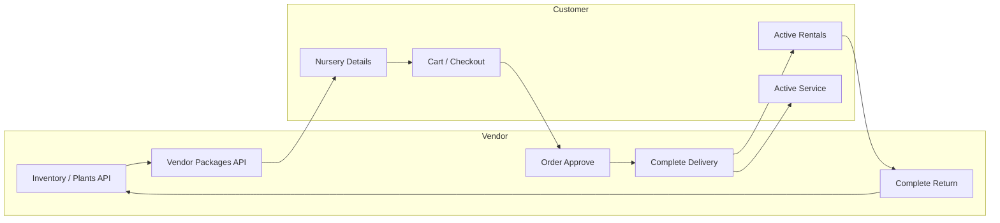

# Inventory Management & Package Plant Allocation

Product specification for how vendor inventory, rental packages, stock reservations, and the rental lifecycle work together across the **Customer App**, **Vendor Nursery Dashboard**, and **Vendor Staff Gardener Dashboard**.

Related API reference: [API_REFERENCE.md](./API_REFERENCE.md)

---

## Overview

The platform provides a complete **inventory and package plant allocation** system connected to the rental workflow.

**Stock lifecycle (target model):**

```
AVAILABLE → RESERVED → DELIVERED → RETURNED → AVAILABLE
```

All inventory updates, package allocations, stock reservations, and availability validations are **backend-driven** so every client stays consistent.

---

## Vendor inventory (Nursery Dashboard)

### Inventory screen

Vendors manage plant inventory from the **Inventory** screen. When adding a plant they provide:

| Field | Description |
|-------|-------------|
| Plant name | Display name |
| Plant image | Primary/catalog image |
| Available quantity | Units rentable/sellable |

### Internal stock states

Each inventory item tracks four logical states:

| State | Meaning |
|-------|---------|
| **Available** | Free for new bookings |
| **Reserved** | Allocated to approved or pending rental orders, not yet delivered |
| **Delivered** | With customer; active rental in progress |
| **Returned** | Transitional — counted back into available after pickup verification |

The system must **automatically transition** stock during the rental lifecycle to prevent double booking and incorrect availability.

---

## Package creation & plant allocation

### Package Creation screen

Vendors create **rental packages** and **add-on services** from the Vendor Nursery Dashboard.

When building a package, vendors select plants from inventory via a **searchable dropdown** showing:

- Plant image  
- Plant name  

They may select **multiple plants** and set **required quantity per plant**. Only plants that exist in inventory appear.

### Package as template

- A package is a **plant allocation template** — it does **not** reduce inventory at creation time.  
- Inventory is affected only when customers create rental bookings.

**Example at package creation:**

| | |
|---|---|
| Inventory | Snake Plant = 20 available |
| Package | Office Package → 2× Snake Plant |
| Stock | Available = 20, Reserved = 0, Delivered = 0 |

---

## Customer nursery details

When a customer opens **Nursery Details**, the app shows data from **Vendor Setup** (vendor dashboard configuration):

- Nursery description  
- Area covered (service areas)  
- Nursery address  
- Location (map / coordinates)  
- Contact number  
- Available rental packages  
- Available add-on services  

### Package selection rules

When a customer selects a rental package:

1. Only plants **assigned to that package** during creation are shown.  
2. Customer **cannot** pick unrelated plants outside the package.  
3. Backend validates availability before confirmation.  
4. Only plants with sufficient **available** stock are selectable.  
5. Fully reserved, unavailable, or actively rented plants must **not** appear as available.

---

## Add-on services

Vendors define optional add-ons, for example:

- Watering  
- Fertilization  
- Maintenance visits  
- Gardener support  

Add-ons attach to the rental order when selected at booking.

### Maintenance flag

| Setting | Behavior |
|---------|----------|
| `maintenance_enabled = true` (package: `includes_maintenance`) | Rental visible in **Active Service** (`customer_plantservice_active`); gardener assignment, maintenance schedules, notifications, and tasks enabled |
| `maintenance_enabled = false` | No maintenance workflow; rental proceeds without gardener assignment or scheduled visits |

Maintenance operations **do not change stock quantities** — plants remain in the delivered/active rental state.

---

## Stock lifecycle by rental stage

How inventory should behave at each order/rental stage.

### 1. Package creation

| | |
|---|---|
| **Order status** | N/A (no order yet) |
| **Inventory** | No quantity change; packages reference inventory only |

---

### 2. Customer booking

| | |
|---|---|
| **Rental status** | `PENDING` |
| **Customer action** | Select package → select package plants → confirm booking |
| **Inventory** | Selected qty moves to **RESERVED**; available decreases for other customers |

**Example:** Customer books 2 Snake Plants.

| Available | Reserved | Delivered |
|-----------|----------|-----------|
| 18 | 2 | 0 |

---

### 3. Vendor rejects booking

| | |
|---|---|
| **Rental status** | `REJECTED` / cancelled by vendor |
| **Inventory** | Reserved qty **released** back to available |

| Available | Reserved | Delivered |
|-----------|----------|-----------|
| 20 | 0 | 0 |

---

### 4. Customer cancels (pending window)

| | |
|---|---|
| **Rental status** | `CANCELLED` |
| **Inventory** | Reserved stock **released** automatically |
| **Flow** | Matches `customer_order_pending` cancellation |

---

### 5. Vendor approves booking

| | |
|---|---|
| **Rental status** | `APPROVED` → `CONFIRMED` / `AWAITING_PAYMENT` |
| **Inventory** | Plants stay **RESERVED**; blocked for other customers |

| Available | Reserved | Delivered |
|-----------|----------|-----------|
| 18 | 2 | 0 |

---

### 6. Payment completed

| | |
|---|---|
| **Rental status** | Paid (`payment_status = PAID`) |
| **Inventory** | No change yet; still **RESERVED** until delivery |

---

### 7. Vendor sends order to processing

| | |
|---|---|
| **Rental status** | `PROCESSING` |
| **Inventory** | No quantity change (preparation only) |

---

### 8. Delivery completed

| | |
|---|---|
| **Rental status** | `DELIVERED` → rental line `ACTIVE` |
| **Inventory** | **RESERVED** decreases; **DELIVERED** increases |
| **Customer UI** | `customer_plantrental_active` (RentalListScreen) |

| Available | Reserved | Delivered |
|-----------|----------|-----------|
| 18 | 0 | 2 |

---

### 9. Active rental period

| | |
|---|---|
| **Rental status** | `ACTIVE` / `EXTENDED` |
| **Inventory** | Delivered plants unavailable for new bookings |

---

### 10. Rental extension

| | |
|---|---|
| **Rental status** | `EXTENDED` |
| **Inventory** | No stock change; same physical plants, longer duration |

---

### 11. Overdue rentals

| | |
|---|---|
| **Rental status** | `OVERDUE` |
| **Inventory** | No restoration until pickup completes; remain **DELIVERED** |

---

### 12. Pickup requested

| | |
|---|---|
| **Rental status** | `PICKUP_PENDING` |
| **Inventory** | No change until physical return verified |

---

### 13. Pickup completed

| | |
|---|---|
| **Rental status** | `COMPLETED` (all rental lines `RETURNED`) |
| **Inventory** | **DELIVERED** decreases; **AVAILABLE** increases |

| Available | Reserved | Delivered |
|-----------|----------|-----------|
| 20 | 0 | 0 |

---

### 14. Failed payment / expired order

| | |
|---|---|
| **Trigger** | Payment timeout, slot expiry, unpaid checkout expiry |
| **Inventory** | Any **RESERVED** quantity **released** to available |

---

## Reservation system goals

- Customers only see **real** available plants  
- **Double booking** prevented  
- **Active rentals** lock inventory  
- **Returned** plants become reusable automatically  
- Sync with booking, approval, delivery, activation, extension, pickup, and maintenance flows  

---

## Backend API mapping

Endpoints that implement or support this architecture today.

### Vendor — inventory & plants

| Purpose | Method | Path |
|---------|--------|------|
| Add/update plant (name, images, quantity) | POST | `/api/v1/plants/vendor/plants` |
| List vendor inventory | GET | `/api/v1/plants/vendor/plants` |
| Update stock quantity | PUT/PATCH | `/api/v1/plants/vendor/plants/:plant_id/stock` |
| Upload plant images | POST | `/api/v1/plants/vendor/plants/:plant_id/images/upload` |
| Bulk inventory update | PUT | `/api/v1/plants/vendor/plants/bulk-update` |
| Vendor inventory analytics | GET | `/api/v1/vendor/analytics/inventory` |

**Add plant body (key fields):** `name`, `stock_quantity`, images; pricing via `rent_price_*`, `buy_price`.

### Vendor — packages & add-ons

| Purpose | Method | Path |
|---------|--------|------|
| Create rental package | POST | `/api/v1/vendor/packages` |
| List / update / deactivate packages | GET, PUT, DELETE | `/api/v1/vendor/packages/:package_id` |
| Public package catalogue (nursery details) | GET | `/api/v1/nurseries/:nursery_id/vendor-packages` |

**Create package body:** `name`, `tier`, `max_plant_count`, `rental_duration_days`, `includes_maintenance`, `base_price`, optional `add_ons` (JSON), `maintenance_visits_per_month`.

### Vendor — nursery setup (Nursery Details data source)

| Purpose | Method | Path |
|---------|--------|------|
| Nursery profile | GET/PUT | `/api/v1/nurseries/my-nursery` |
| Service areas (area covered) | GET/PUT | `/api/v1/nurseries/my-nursery/service-areas` |
| Working hours | GET/PUT | `/api/v1/nurseries/my-nursery/working-hours` |
| Onboarding checklist | GET | `/api/v1/vendor/onboarding` |
| Public nursery detail | GET | `/api/v1/nurseries/:nursery_id` |
| Public nursery by slug | GET | `/api/v1/nurseries/slug/:slug` |

### Customer — browse, validate, book

| Purpose | Method | Path |
|---------|--------|------|
| Nursery catalog plants | GET | `/api/v1/nurseries/:nursery_id/plants` |
| Check plant availability for dates | GET | `/api/v1/plants/:plant_id/availability` |
| Check availability (batch) | POST | `/api/v1/rentals/availability` |
| Add package to cart | POST | `/api/v1/cart/packages` |
| Add rental line to cart | POST | `/api/v1/cart/items` |
| Validate cart before checkout | POST | `/api/v1/cart/validate` |
| Create order | POST | `/api/v1/orders/checkout` |
| Active rentals hub | GET | `/api/v1/orders/customer/active-rentals` |

**Checkout body:** `delivery_address_id`, `payment_method`, optional `notes`, `coupon_code`.

**Cart item (rent):** `plant_id`, `order_type: "RENT"`, `quantity`, `rent_start_date`, `rent_end_date`.

### Vendor — approval, delivery, return (inventory side effects)

| Stage | Method | Path | Inventory effect (target) |
|-------|--------|------|---------------------------|
| Approve + plant mapping | PUT | `/api/v1/orders/vendor/orders/:order_id/approve` | Reserve / commit stock |
| Reject | POST | `/api/v1/orders/vendor/orders/:order_id/reject` | Release reserved |
| Process | POST | `/api/v1/orders/vendor/orders/:order_id/process` | No stock change |
| Complete delivery | POST | `/api/v1/orders/vendor/orders/:order_id/complete-delivery` | Reserved → delivered |
| Complete return | POST | `/api/v1/orders/vendor/orders/:order_id/complete-return` | Delivered → available |
| Assign gardener (maintenance) | POST | `/api/v1/orders/vendor/orders/:order_id/assign-gardener` | No stock change |

**Approve body:** `plant_selections[]`: `{ order_item_id, plant_id }`.

**Complete return body:** `collection_date`, `items[]` with `order_item_id`, `condition`, `restock` (boolean), proof fields.

### Customer — cancel, extend, return

| Purpose | Method | Path |
|---------|--------|------|
| Cancel order | POST | `/api/v1/orders/:order_id/cancel` |
| Extend rental | POST | `/api/v1/orders/:order_id/items/:item_id/extend-rental` |
| Initiate return | POST | `/api/v1/orders/:order_id/items/:item_id/return` |

### Maintenance & active service

| Purpose | Method | Path |
|---------|--------|------|
| Vendor create maintenance task | POST | `/api/v1/vendor/tasks` |
| Assign gardener to order | POST | `/api/v1/orders/vendor/orders/:order_id/assign-gardener` |
| Customer maintenance tasks | GET | `/api/v1/user/tasks` |
| Gardener task workflow | GET/POST | `/api/v1/tasks/*` |

Enabled when package/order has `includes_maintenance = true` and gardener is assigned.

### Internal — expiry & stock release

| Purpose | Method | Path |
|---------|--------|------|
| Expire unpaid orders + release stock | POST | `/api/v1/internal/jobs/orders/expire-unpaid` |
| Full expiry sweep | POST | `/api/v1/internal/jobs/orders/expire-sweep` |
| Penalty / overdue sweep | POST | `/api/v1/internal/jobs/orders/penalty-sweep` |

---

## Current backend implementation (May 2026)

The inventory spec is **implemented** in this repository. Key behavior:

### Stock storage model

| Column | Meaning |
|--------|---------|
| `Plant.stockQuantity` | **Available** — free for new bookings |
| `Plant.reservedQuantity` | **Reserved** — allocated at checkout, not yet delivered |
| `Plant.deliveredQuantity` | **Delivered** — with customer on active rental |

Order flags: `inventoryReservedAt` (set at checkout), `inventoryDeliveredAt` (set at delivery complete).

Dedicated vendor APIs: `GET /api/v1/inventory`, `GET /api/v1/inventory/picker`.

Date-range availability still uses overlapping rental checks: `GET /api/v1/plants/:plant_id/availability`, cart validation, `POST /api/v1/rentals/availability`.

### Stock transitions

| Stage | Behavior |
|-------|----------|
| Checkout (`PENDING`) | `assertCanReserve` → `reserve` (available ↓, reserved ↑); sets `inventoryReservedAt` |
| Vendor approve | Validates reserved stock (or legacy `stockQuantity` for old orders); **no** counter change |
| Cancel / reject / expire (before delivery) | `releaseReserved` when `inventoryReservedAt` set; legacy restore when approve-time decrement only |
| Delivery complete | `deliverReserved` (rent) or `finalizeBuyFromReserved` (buy); sets `inventoryDeliveredAt` |
| Return complete | `returnDeliveredToAvailable` when delivered; GOOD condition auto-restocks on new orders; legacy uses `items[].restock` |

Code: `PlantInventoryService`, `OrdersService`, `OrderContractFlowService.vendorCompleteReturn`, `InternalJobsService.expireOrderWithStockRelease`.

### Package ↔ plant allocation

- `VendorPackagePlant` join table stores `plant_id` + `quantity` per package.
- Create/update via `POST/PUT /api/v1/vendor/packages` with optional `plants[]`.
- Public catalogue filters packages by sufficient **available** stock.
- Cart: `POST /api/v1/cart/packages` with `vendor_package_id`; checkout expands package plants into RENT order lines.

### Maintenance & add-ons

Unchanged — `VendorPackage.includesMaintenance`, `addOns` JSON, gardener assignment, vendor/user tasks APIs.

### Legacy orders

Orders created before this migration may have `vendorApprovalSelections` without `inventoryReservedAt`. Cancel/reject/expire restores via `legacyRestoreAvailable`; return restock uses explicit `items[].restock`.

---

## Integration diagram



---

## Frontend screen mapping

| Screen | Primary data sources |
|--------|---------------------|
| Vendor Inventory | `GET /api/v1/inventory`, `GET /api/v1/inventory/picker`, `GET/POST/PUT /api/v1/plants/vendor/plants*` |
| Vendor Package Creation | `POST /api/v1/vendor/packages` + plant picker from vendor plants |
| Nursery Details (customer) | `GET /api/v1/nurseries/:id`, `.../vendor-packages`, vendor setup fields |
| Package booking | Cart packages + checkout |
| RentalListScreen (`customer_plantrental_active`) | `GET /api/v1/orders/customer/active-rentals` |
| ActiveServiceScreen (`customer_plantservice_active`) | Orders with maintenance + `GET /api/v1/user/tasks` |
| Pending orders | `GET /api/v1/orders` (status filters) |

---

## Summary

The **target architecture** uses explicit available → reserved → delivered → returned transitions tied to every rental status. The backend implements this via `PlantInventoryService`, `VendorPackagePlant`, checkout reservation, delivery/return transitions, and the inventory API endpoints above.

---

*Spec source: product requirements (Sara Class, May 2026). Implementation notes reflect this repository at time of writing.*
